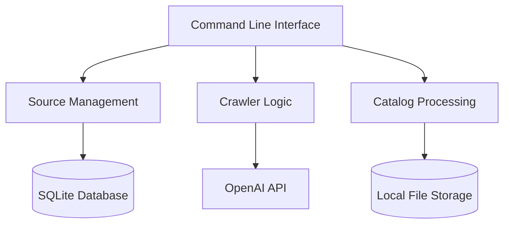
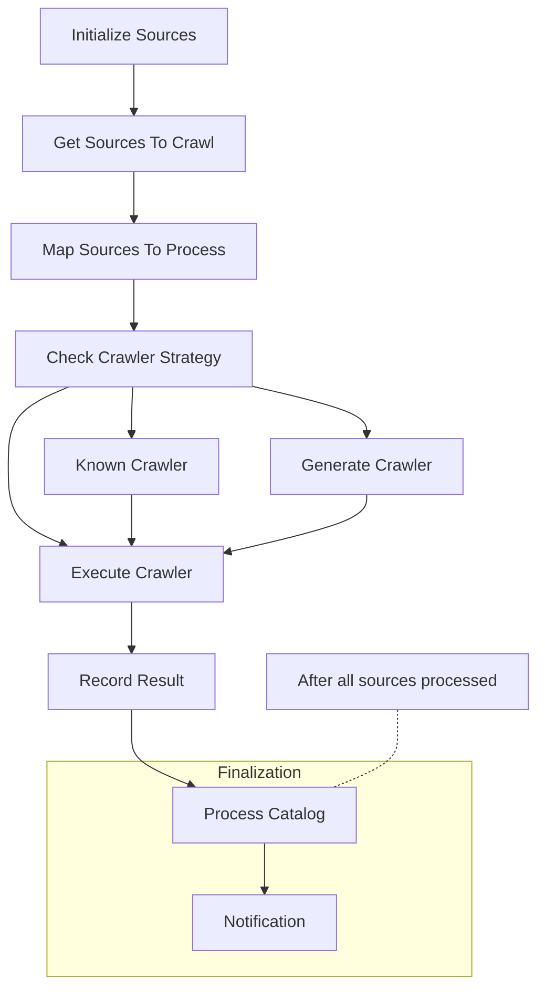

# MCP Tool Crawler

A Python-based service for discovering, crawling, and cataloging Machine Context Protocol (MCP) tools from various sources. The crawler leverages local storage and AI-powered code generation to automatically extract MCP tools from diverse sources.

## Source List Management

Sources to crawl are managed in a YAML file (`sources.yaml`) which is stored in the local data directory.

### YAML Format

The source list YAML has the following format:

```yaml
sources:
  - url: https://github.com/user/awesome-repo
    name: Awesome Repository
    type: github_awesome_list
  - url: https://example.com/tools
    name: Example Tools
    type: website
```

Fields:
- `url`: The URL of the source to crawl (required)
- `name`: A friendly name for the source (optional, will be auto-generated if not provided)
- `type`: The source type (optional, will be auto-detected if not provided):
  - `github_awesome_list`: GitHub awesome list
  - `github_repository`: GitHub repository
  - `website`: Generic website
  - `rss_feed`: RSS feed
  - `manually_added`: Manually added source

### Workflow

1. Edit the `sources.yaml` file with the sources you want to crawl
2. Run the crawler using the CLI commands
3. The crawler will process the sources and discover tools
4. Results will be stored in the local SQLite database and file storage

## Project Overview

The MCP Tool Crawler aims to build a comprehensive catalog of Machine Context Protocol (MCP) tools by automatically discovering and extracting information from various sources including GitHub repositories, awesome lists, and websites.

Key features:
- Automated crawling of GitHub awesome lists and repositories
- AI-powered crawler generation for unknown websites
- Deduplication and standardization of tool information
- Persistent storage in SQLite and local files for accessibility
- Simple command-line interface for managing sources and running crawls

## Architecture

The system uses a local architecture with the following components:


1. **SQLite Database**: Stores sources, crawler strategies, and metadata
2. **Local File Storage**: Stores the consolidated tool catalog
3. **Python Modules**: Execute each step of the workflow
4. **OpenAI**: Generates custom crawlers for unknown websites

### Detailed Component Diagram



### Workflow Overview

The system follows a multi-step workflow:




### AI Crawler Generation Process

For websites without a predefined crawler:

1. The system analyzes the website structure using OpenAI
2. A custom Python crawler is dynamically generated 
3. The generated code is executed in a secure sandbox
4. Results are processed and added to the catalog

```mermaid
flowchart LR
    FW[Fetch Website Content] --> GC[Generate Crawler with AI]
    GC --> VG[Validate Generated Code]
    VG --> ES[Execute in Sandbox]
    ES --> CF[Clean & Filter Data]
    CF --> EM[Extract MCP Tools]
    EM --> PR[Process Results] 
    PR --> SC[Save to Catalog]
    
    style GC fill:#f9f,stroke:#333,stroke-width:2px
    style ES fill:#bbf,stroke:#333,stroke-width:2px
```




## Components

### Sources & Crawlers

- **Sources**: Represent locations where MCP tools can be found (GitHub repos, websites, etc.)
- **Crawlers**: Components responsible for extracting tools from sources
- **Crawler Strategies**: AI-generated code to extract tools from specific websites

### Python Modules

| Module | Description |
|----------|----------------|
| Source Manager | Initializes and manages sources in SQLite |
| Crawler Generator | Uses OpenAI to generate custom crawlers |
| Known Crawler Runner | Runs built-in crawlers (GitHub, RSS, etc.) |
| Generated Crawler Runner | Safely executes AI-generated crawlers |
| Catalog Processor | Deduplicates and updates the master catalog |

### Crawler Types

1. **GitHub Awesome List Crawler**: Extracts tools from markdown-based awesome lists
2. **GitHub Repository Crawler**: Extracts information about MCP-related GitHub repos
3. **AI-Generated Crawler**: Dynamic crawlers for websites without a predefined crawler
4. **RSS Feed Crawler**: Extracts tools from RSS feeds (planned)

## Development

### Setting Up Development Environment

```bash
# Clone the repository
git clone https://github.com/your-org/mcp-tool-crawler.git
cd mcp-tool-crawler

# Using Poetry (recommended)
# Install Poetry if you don't have it
curl -sSL https://install.python-poetry.org | python3 -

# Install dependencies
poetry install

# Activate the virtual environment
poetry shell

# Alternative: Using pip with venv
# Create a virtual environment
python -m venv venv
source venv/bin/activate  # On Windows: venv\Scripts\activate

# Install dependencies
pip install -r requirements.txt

# Configure environment variables
cp .env.example .env
# Edit .env file with your settings
```

### Running Locally

```bash
# With Poetry (recommended)
# Initialize sources
poetry run mcp-crawler init

# List all sources
poetry run mcp-crawler list

# Add a new source
poetry run mcp-crawler add "https://github.com/example/awesome-mcp-tools" --name "Example Tools"

# Crawl a specific source
poetry run mcp-crawler crawl --id "source-123456"

# Crawl all sources
poetry run mcp-crawler crawl --all

# Alternative: Using Python module directly
python -m src.cli init
python -m src.cli list
python -m src.cli add "https://github.com/example/awesome-mcp-tools" --name "Example Tools"
python -m src.cli crawl --all --concurrency 3
```

### Running Tests

```bash
# With Poetry (recommended)
# Run all tests
poetry run pytest

# Run specific test file
poetry run pytest tests/test_github_crawler.py

# Run with coverage
poetry run pytest --cov=src

# With venv/pip
pytest
pytest tests/test_github_crawler.py
pytest --cov=src
```

## Security Considerations

- **Sandboxing**: AI-generated code is executed in a restricted sandbox using RestrictedPython
- **Input Validation**: All user inputs and API responses are validated
- **Rate Limiting**: API throttling for external dependencies
- **Logging & Monitoring**: Comprehensive logging and monitoring

## Future Enhancements

- **Advanced Deduplication**: ML-based similarity detection for tools
- **Web UI**: Management interface for sources and tools
- **Additional Sources**: Support for more types of sources
- **Enhanced Metadata**: Extract and normalize more tool metadata
