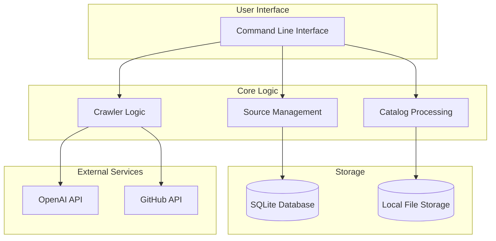
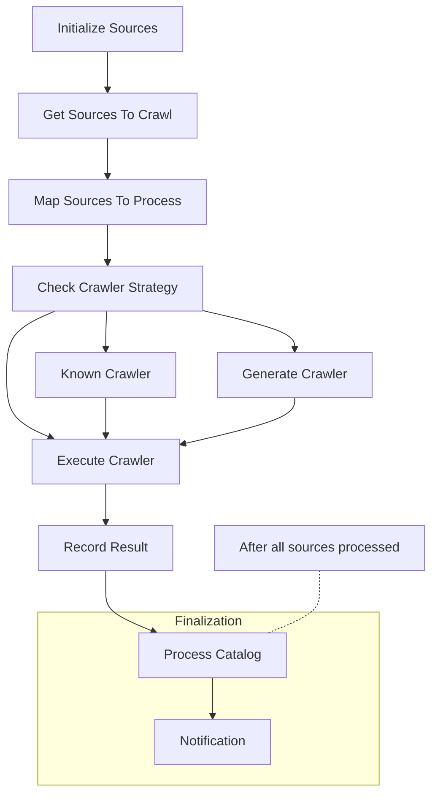

# Local Architecture Diagram



# Workflow Diagram



# Migration Flow

```mermaid
flowchart LR
    AWS[(AWS Services)] --> EX[Export Scripts]
    EX --> MF[Migration Files]
    MF --> IM[Import Scripts]
    IM --> SQ[(SQLite Database)]
    IM --> FS[(Local File Storage)]
    
    subgraph AWS Storage
        DDB[(DynamoDB)]
        S3[(S3 Bucket)]
    end
    
    subgraph Local Storage
        SQ
        FS
    end
    
    AWS --> AWS Storage
    AWS Storage --> EX
    
    style AWS fill:#FF9900,stroke:#232F3E,stroke-width:2px
    style SQ fill:#003B57,stroke:#003B57,stroke-width:2px
    style FS fill:#4CAF50,stroke:#2E7D32,stroke-width:2px
```

